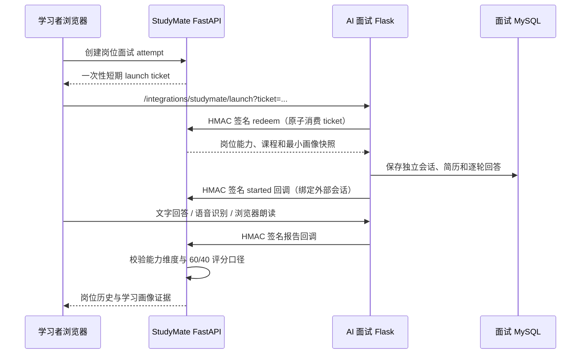

# AI 面试服务接入说明

StudyMate 的 AI 面试是独立部署的 Git submodule，服务代码位于同级目录 `ai-interview/`。团队维护仓库为 [studymate-team/ai-interview](https://github.com/studymate-team/ai-interview)，原始项目来自 [Gitee ai-interview](https://gitee.com/uorol123/ai-interview)；面试仓库保留 Gitee 为 `upstream` 参考。

## 原项目说明

原项目是完整的 AI 面试官系统，不只是一个聊天页，原有能力继续保留：

- 求职者端：简历上传与解析、岗位模拟面试、文字/WebSocket 实时面试、评分报告、个人资料和简历管理。
- 企业端：企业资料、职位发布、候选人管理、面试安排、评分权重和报告查看。
- AI 与语音：OpenAI 兼容大模型、讯飞语音识别/合成、实时会话和数字人资源。
- 技术结构：Flask、Flask-SocketIO、SQLAlchemy、MySQL、Jinja 模板和 JavaScript/CSS 静态资源。

本次改造保留上述 legacy 路由、模型、模板和企业流程，同时新增 StudyMate 学习者实践流。数据库、上传文件和会话仍由面试服务独立拥有；主系统不读取面试服务的 MySQL 表。

## 当前学习者流程



岗位目录由 StudyMate 后端维护，前端只提交 `role_id` 和可选 `course_id`。岗位能力要求从服务端快照传给面试服务，浏览器 URL 不包含正式用户身份、画像或能力列表。面试服务的 StudyMate 学习者流使用一次性外部身份会话，不重复创建本地密码登录界面。

报告只有在以下条件同时满足时才会写回 StudyMate：

- 报告 schema、attempt、岗位能力集合和时间字段校验通过；
- 岗位匹配分、通用能力分和总分符合岗位 60%、通用能力 40% 的固定计算；
- 面试服务确实生成了可解析的模型评估。模型未配置或返回非法 JSON 时，面试会话进入 `report_failed`，不会写入零分证据。

回写内容进入 `interview_assessments`，与理论测验和就业技能并列；诊断 Agent 会把面试弱项作为额外证据，不覆盖原有理论成绩。

## 服务边界与网络

```text
浏览器 -> Caddy
          └── matropic.cn
              ├── /                    -> StudyMate frontend -> backend
              └── /interview/*         -> ai-interview:5000

StudyMate backend <----签名 HTTP----> ai-interview
                                      │
                                      └── 私有 MySQL + uploads volume
```

- 两个 Compose 项目通过名为 `studymate_edge` 的受控网络连接，只用于反向代理和签名 API。
- 面试 MySQL 只加入面试项目自己的默认网络，不加入 `studymate_edge`。
- 面试端口只绑定 `127.0.0.1`；生产公网入口由主项目 Caddy 在现有域名的 `/interview/` 路径提供，无需新增 DNS、证书或公网端口。
- 双方共享的 `AI_INTERVIEW_SERVICE_SECRET` 只放在两个后端容器环境变量中，绝不进入前端构建产物。

StudyMate 学习者面试流以 `/interview/` 发布。原项目 legacy 前后台的旧路由大量使用根路径和 `/api`，会与 StudyMate 主系统命名空间冲突，因此不通过该同域路径直接公开；相关代码和独立容器能力仍保留。若后续确实需要对外启用旧后台，应先完成其路由命名空间迁移，而不是增加一条简单反向代理规则。

## 配置

主项目将 `studymate/.env.example` 复制为 `backend/.env`，至少填写：

```dotenv
AI_INTERVIEW_PUBLIC_URL=http://localhost:5000
AI_INTERVIEW_SERVICE_SECRET=同一条随机长密钥
```

面试项目将 `ai-interview/.env.example` 复制为 `.env`，至少填写：

```dotenv
FLASK_SECRET_KEY=另一条随机长密钥
MYSQL_PASSWORD=...
MYSQL_ROOT_PASSWORD=...
STUDYMATE_API_URL=http://backend:8000
STUDYMATE_SERVICE_SECRET=同一条随机长密钥
LLM_API_KEY=...
```

生产环境额外在 `ai-interview/.env` 设置：

```dotenv
PUBLIC_BASE_PATH=/interview
SESSION_COOKIE_SECURE=1
```

启用语音时，再填写 `XFYUN_APP_ID`、`XFYUN_API_KEY` 和 `XFYUN_API_SECRET`。浏览器只会从 `/api/speech/asr-url` 取得短时签名 WebSocket URL，不会取得 API Secret。

## Docker 启动

先启动 StudyMate，确保它创建共享网络：

```bash
cd studymate
cp .env.example backend/.env
docker compose up -d --build
```

然后启动独立面试服务：

```bash
cd ../ai-interview
cp .env.example .env
docker compose up -d --build
curl http://localhost:5000/health
```

若单独启动面试服务而主项目尚未启动，先创建网络：

```bash
docker network create studymate_edge
```

本地不启用 Caddy 时，`backend/.env` 中的 `AI_INTERVIEW_PUBLIC_URL=http://localhost:5000`；当前生产环境把 `backend/.env` 的 `AI_INTERVIEW_PUBLIC_URL` 设置为 `https://matropic.cn/interview`，并在 `ai-interview/.env` 设置 `PUBLIC_BASE_PATH=/interview` 与 `SESSION_COOKIE_SECURE=1`。公网启动：

```bash
cd studymate
docker compose --env-file .deploy.env --profile public up -d --build
```

## 迁移与运维

面试服务启动时执行命名迁移 `schema_migrations`，StudyMate 学习者表包括 `external_identities`、`practice_launches`、`practice_resumes`、`practice_interviews` 和 `practice_interview_turns`。不要用共享数据库或启动时无条件覆盖表结构替代迁移。生产升级前备份 `ai_interview_mysql` 和 `ai_interview_uploads` 卷。

当前 Socket.IO 生产配置是单 Gunicorn worker、多线程；需要横向扩容时必须先引入 Redis message queue，并为会话与回调增加跨实例一致性方案。

## 当前验收边界

- 文字面试、浏览器朗读、主动语音输入和本地数字人模型属于首期学习者流；摄像头不参与评分。
- 当前同域发布入口为 `https://matropic.cn/interview/`；Caddy 会把该路径转发到独立面试容器。
- 原项目 legacy 招聘后台仍保留在独立服务中，但其根路径与 `/api` 路由尚未命名空间化，不能与 StudyMate 同域直接公开。
- 未配置 LLM 时可以进行问答演示，但不会产生可回传的能力评分。
- 未配置讯飞语音时文字面试仍可用，语音按钮会返回明确的配置提示。
- 完整 Docker/跨容器验收需要 Docker daemon、Python 3.11 镜像和实际 MySQL；本地 Python 3.14 不作为后端运行环境。
