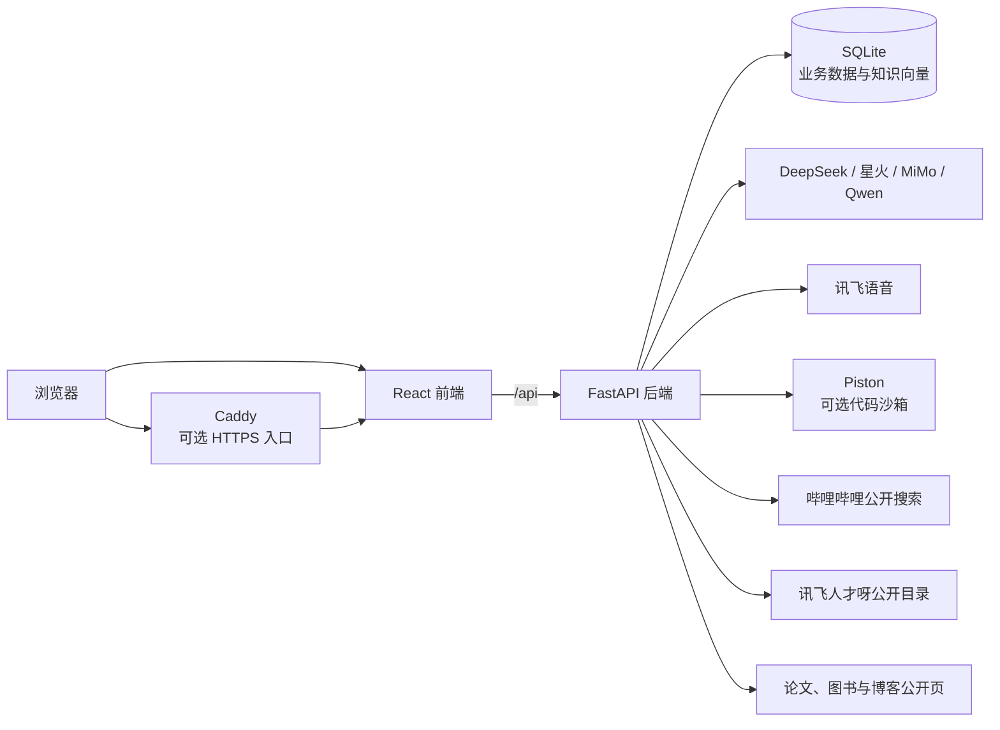
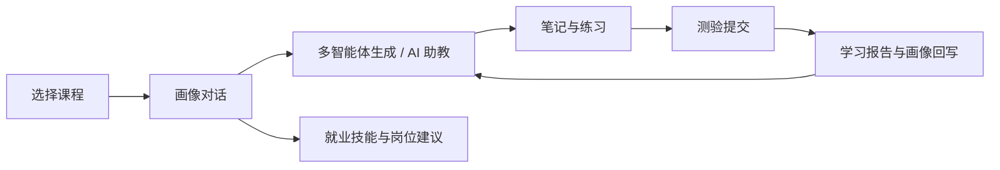

# StudyMate 系统架构

> 最后核对：2026-08-01。本文描述当前代码主链路，不把历史规划或可选容器误写成已启用能力。

## 1. 总体结构

- 默认 Docker Compose 启动 `frontend` 与 `backend`。
- `code-runner` Profile 增加 Piston，`public` Profile 增加 Caddy。
- `extras` Profile 可启动 PostgreSQL、Redis 和 Chroma，但当前业务主链路仍使用 SQLite。
- 前端开发环境由 Vite 代理 `/api`；生产前端由 Nginx 托管静态资源并转发 API。

## 2. 应用分层

| 层级 | 主要位置 | 职责 |
| --- | --- | --- |
| 页面与交互 | `frontend/src/pages/`、`frontend/src/components/` | 页面路由、可视化、SSE 展示、学习流程交互 |
| 前端状态与 API | `frontend/src/store/`、`frontend/src/lib/` | 跨页面生成状态、接口调用、类型定义 |
| 接口层 | `backend/app/api/` | 请求校验、认证依赖、业务编排和响应输出 |
| Agent 与检索 | `backend/app/agents/` | 画像、检索、文档、导图、测验、阅读、代码、路径和评估 |
| 业务与数据 | `backend/app/db/`、`backend/app/courses/` | SQLAlchemy 模型、课程注册和持久化 |
| 外部适配 | `backend/app/integrations/` | 第三方公开数据访问、缓存、清洗和兜底 |
| 部署维护 | `backend/scripts/`、`scripts/` | 容器入口、数据清理、种子库生成和运维 |

登录后由 `AppShell` 统一管理左侧一级导航、课程卡、辅助入口、折叠/移动端抽屉和沉浸页行为。首页首先呈现单屏“学习宇宙 · 实时指挥舱”：顶部状态栏显示 Asia/Shanghai 秒级时间、当前课程和接口同步状态；左侧将个人画像/笔记/测验/评估/workspace 证据与课程/RAG 平台能力分开；中央以学习者核心、今日闭环进度和七颗可点击能力星球组织真实入口；右侧直接订阅 workspace store 的 `status / agents / agentStatus / outputs`；底部由真实时间戳生成最近动态和近 7 日事件构成。任一接口失败只降级对应来源，不会让首屏整体消失，也不会用平台能力、测试 fixture 或模拟成绩填充个人数据。

一次性进场、远景彗尾、弱化空闲巡航、任务态飞船、轨道受光、节点信号与星球微动均由首屏可见性和 `prefers-reduced-motion` 约束；可见比例低于阈值后暂停。首页宇宙可见期间隐藏全局悬浮数字人，避免遮挡指标、节点与 CTA；进入或滚动到今日学习桌面后再显示暖白应用壳和原有数字人入口。学习资源工坊继续作为独立高频入口展示 7 Agents 完整状态。

评委演示与普通新手指引相互独立。它只用 `sessionStorage` 保存临时步骤，进入时记录课程与路径，退出或完成后恢复；演示路线只导航真实页面，不预造学习结果，也不触发付费模型或语音调用。

## 3. 核心学习链路

课程上下文会影响检索范围、助教会话、生成记录、笔记、测验、报告和岗位推荐。岗位推荐综合就业技能、当前课程、已提交测验涉及的课程和学习目标，在后端本地计算匹配分数与差距说明。

## 4. 画像与多智能体

学习画像共有 7 组：

1. `knowledge_base`：知识基础。
2. `cognitive_style`：认知风格。
3. `goals`：学习目标。
4. `weak_points`：薄弱点。
5. `pace`：学习节奏。
6. `preference`：内容偏好。
7. `employment_skills`：编程、算法、数据与 AI、系统与网络、工程实践、职业素养。

工作台对用户展示 7 个协作者：Retriever 先检索课程上下文，Doc、MindMap、Quiz、Reading、Code、Path 分别生成文档、导图、检测题、拓展阅读、代码示例和学习路径。

学习路径按阶段深度排序，每行最多 4 个节点并采用蛇形回折布局；前端会把旧版直线位置重新规范化，并将连线整理为相邻阶段，避免长路径横向溢出。

画像对话采用字段级清洗：单个非法字段不会丢弃同轮合法更新；只有画像实际变化时才保存修改前快照并增加版本。明确项目、实习或实践证据可以保守补充就业技能，单纯求职意向只进入学习目标。

评估接口同时返回 `current_dims` 和按同一规则计算的 `projected_dims`。报告先展示“评估前 / 建议应用后”，用户确认后才携带 `source_version` 写回；版本过期返回 `409`，无实际变化时不创建快照。答题证据按主题与难度聚合为热力图，并分别展示作答完成率、可用资源覆盖率和参与度组成，不把不同口径强行合成单一达成分。

测验空答案统一视为非能力标签 `未作答`。新提交只保存这一项；历史混合标签在输出和自适应统计时规范化，因此无需修改既有测验数据。

## 5. RAG 与知识库

- 数据库存储 5 门课程和 1709 个知识块。
- BM25 负责关键词匹配，Qwen `text-embedding-v3` 生成 1024 维语义向量。
- 两路结果通过 RRF 融合，返回知识块编号、来源、页码或元数据，支持前端原文追溯。原始 RRF 小数只用于排序；界面使用按启用分支理论最高分归一化的“相对匹配度”，同时明确其不是正确概率。
- 向量当前保存在 SQLite JSON 列中；Chroma 容器属于扩展预留，不在默认检索链路中。
- 用户私有知识库独立使用 `user_knowledge_*` 三张表；库、资料、分片均保存 `user_id`，查询、更新、删除和助教注入同时校验资源 ID 与登录用户。
- 私有资料支持课程绑定、解析/向量进度和来源页码。没有向量 Key 时明确退化为 BM25 关键词检索。
- 上传请求只负责校验、持久化原文件与创建 `queued` 任务；后台任务使用独立数据库会话完成解析/向量化。状态、进度、SHA-256、开始/完成时间和重试次数写入数据库，服务重启会把中断任务转为明确失败，原文件保留供最多 3 次安全重试。
- 原文件位于 `PRIVATE_KNOWLEDGE_DIR/{user_id}/` 受控目录，不通过接口返回路径；删除资料或知识库同步删除分片、向量和原文件。扫描 PDF 当前标记可插拔 OCR 未配置，不伪装成功。

## 6. AI 助教、附件与可视讲解

- 会话按用户和课程持久化，可创建、切换、重命名和删除。
- 请求会携带页面上下文、当前课程、画像和学习模式；响应通过 SSE 输出 `meta`、`delta`、`done` 等事件。
- 普通文字助教与实时语音共享 Qwen、DeepSeek、讯飞星火、MiMo 选择；服务端验证选择及配置，不暴露凭据、不静默切换。带图片时只允许显式选择 Qwen 并使用视觉模型。
- 全局悬浮助教与实时语音页复用 `idle / listening / thinking / speaking / paused` 状态媒体契约。比赛素材为同一人物的 AI 生成透明姿态，通过交叉淡化与轻微呼吸形成状态感；它不是视频、动作捕捉或逐音素口型，`paused` 有诚实静态回退并支持减弱动态。
- 语音页通过只读配置接口先判断 ASR/TTS 是否可用；ASR 未配置时明确降级并保留文字记录。麦克风只在用户明确点击后申请，页面加载不会触发权限弹窗。
- 支持 PDF、Markdown、文本和常见代码文件，单文件上限 10 MB；后端只提取受限长度的文本用于上下文。
- 前端生成状态在页面或抽屉卸载后仍可继续接收，并按用户与课程隔离，停止或失败时保留已生成内容。
- 助教消息会对长链接、连续文本和代码执行容器内换行；`/tutor?capture=1` 可展开完整对话用于整页截图，普通模式仍保留内部滚动。
- 概念讲解按“动画目录版本 + 用户 + 规范化问题”缓存，真实模型结果保留 10 分钟、模拟结果保留 1 分钟，最多 20 项。只有用户在工作台显式生成资源时才预取，进入结果页复用同一 Promise；失败项会清除，下一次允许重试。
- AI 视频讲解由子动画注册可计算节拍；TTS 音频存在时使用实际 `duration`，否则使用文本估算。seek 会重新定位拍内动画帧，当前时间、字幕高亮、暂停与倍速共用同一内容时钟；普通/全屏布局仍分别计算。
- PPT 大纲与单页重写使用服务端白名单路由 Qwen、DeepSeek、讯飞星火、MiMo，复用课程 RAG 和当前用户私有知识上下文。未配置或调用失败时不换模型；本地策略必须由用户明确选择。输出经结构校验后进入模板、版式、引用和图表页编辑，再由前端懒加载 PptxGenJS 导出真实可编辑元素。

## 7. 认证、角色与数据边界

- 注册使用邮箱验证码和密码；密码只保存安全哈希。
- 登录写入 HttpOnly `sm_session` Cookie，服务端只保存令牌哈希、到期时间和撤销状态。
- `student` 使用学习功能；`judge` 与 `admin` 可访问测试管理和统计接口；只有 `admin` 可发布反馈回复。
- 生产环境必须使用 HTTPS、随机 `AUTH_SECRET_KEY` 和 `SESSION_COOKIE_SECURE=true`。
- 当前 `profile`、`eval`、`workspace` 和 `notes` 的部分接口仍允许客户端提交 `user_id`，而 RAG 导入/清空仍是登录级权限；正式多租户上线前应统一审计资源所有权、管理写操作权限和审计日志。

## 8. 外部资源与隐私

### 哔哩哔哩

后端根据规范概念、核心技术词和课程锚点并行进行 WBI 公开视频搜索，候选经本地相关度过滤后才返回。没有高相关卡片时只提供精确搜索入口；成功结果缓存 30 分钟。系统只返回外部链接，不嵌入或代理视频内容。

### 讯飞人才呀

- 课程接口只获取公开课程目录，并使用清洗后的技术主题判断 `exact`、`related`、`course` 或 `fallback`；前端只展示知识点级的 `exact`/`related` 卡片。
- 课程检索只发送清洗后的技术主题和课程名称；岗位接口只获取公开岗位目录。用户标识、画像、对话历史和认证信息不会发送给人才呀。
- 外部图片地址只允许受信任的人才呀 MinIO 主机，其他地址不进入前端展示。

### 拓展阅读

- 中文论文的知网入口只使用用户选定主题，不使用模型扩写的论文标题；知网可能触发官方验证，因此同时提供备用论文搜索。
- 前端先为博客、书籍和论文构造确定性搜索入口，再调用受保护的 `POST /api/reading/resolve` 尝试补充真实详情页；解析失败时仍保留搜索入口，不把模型生成标题直接当作可信链接。
- 论文通过 arXiv 摘要页或 Crossref DOI 校验，图书通过豆瓣图书详情页校验，博客只接受 CSDN 文章页或掘金文章页。所有结果还需通过标题相似度、HTTPS、主机和路径格式检查。
- 解析请求每批最多 12 项，并发上限为 4、单次超时 6.5 秒；成功和未命中结果缓存 6 小时，进程内最多 512 项。只向公开目录发送标题、资源类型、来源名称和语言，不发送用户标识、画像、对话、Cookie 或认证信息。
- CSDN、知乎继续通过域名限定搜索提供稳定兜底；官方文档只有在 HTTPS 且命中集中维护的可信官方域名时，才额外显示“官方原文”。

## 9. 数据库与种子库

- 本地开发库：`backend/studymate.db`，不提交 Git。
- 提交用种子：`backend/resources/seed/studymate.db.gz`，由 `scripts/build_seed_db.py` 脱敏、校验并压缩生成。
- Docker 首次启动空数据卷时解压种子；有数据时不覆盖。
- 当前启动过程包含 SQLite 开发期轻量迁移。长期生产维护应引入 Alembic 管理结构版本。
- 启动迁移和课程增量导入写入 `system_migrations`；管理员可通过只读数据健康卡查看课程、知识块、向量、私有任务和迁移记录。

## 10. 相关文档

- [接口说明](接口说明.md)
- [开发与验收指南](开发与验收指南.md)
- [Ubuntu 部署指南](Ubuntu部署指南.md)
- [密钥管理指南](密钥管理指南.md)
